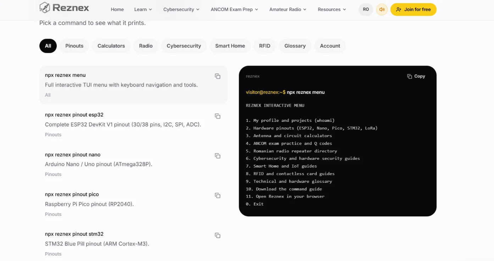
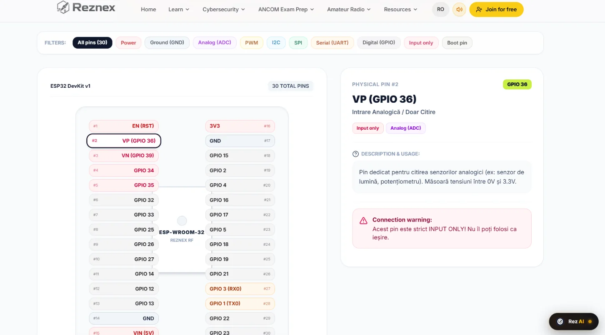
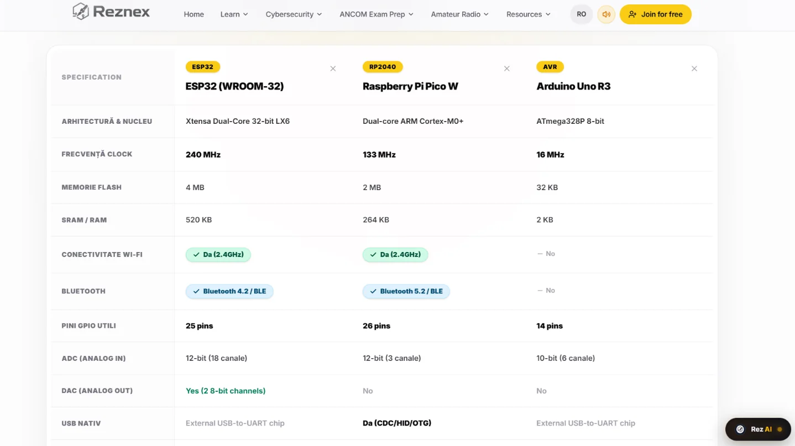
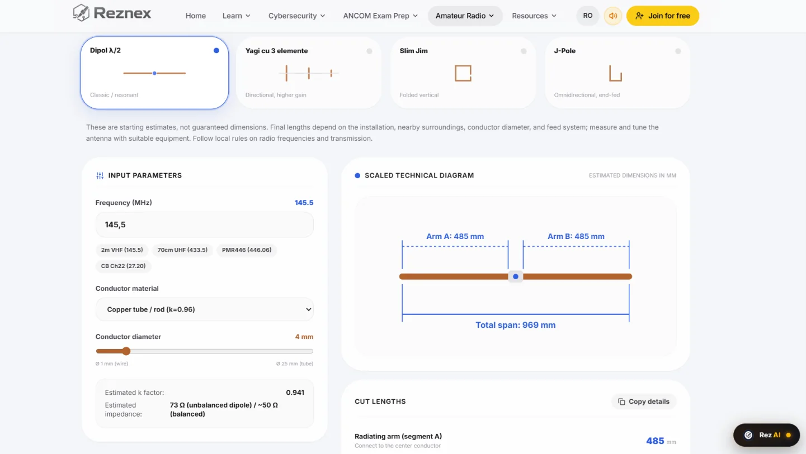
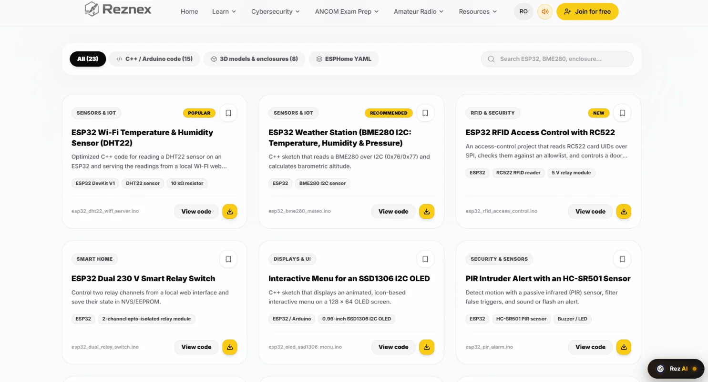

# Reznex Review: ESP32 Pinouts, Hardware Tools, CLI and More




Choosing a GPIO for an ESP32 project rarely happens in one place.

You may start with a pinout diagram, open Espressif's documentation to check boot-strapping behavior, look at the schematic of the development board, compare another microcontroller, run a resistor calculation, and then search GitHub for an example that actually works.

For a small project, that is manageable.

For a project involving an ESP32, display, touchscreen, SD card, sensors and wireless connectivity, it quickly becomes a collection of browser tabs and reference documents.

**Reznex is trying to bring several of those tasks together.**

It provides interactive hardware pinouts, board comparison, electronics and RF calculators, a command-line interface, an API, project resources and an Engineering Vault. Its scope also extends into LoRa, RFID, cybersecurity, amateur radio and smart-home technologies.

But breadth alone does not make an engineering resource reliable.

So rather than asking whether Reznex is "the best" electronics website, this review asks a more useful question:

> **Does Reznex actually save time when working on embedded and electronics projects, and where do you still need the manufacturer's documentation?**

This review is based on the current Reznex website and published CLI information, cross-checked against official Espressif documentation where hardware claims matter. Where functionality could not be independently executed or inspected, that limitation is stated explicitly.

---

# What Is Reznex?

Reznex is an electronics, embedded, RF and maker-oriented technical platform combining reference material, tools, calculators, projects and community resources.

Its scope includes:

- ESP32
- Arduino
- Raspberry Pi Pico
- STM32
- LoRa and RF
- RFID/NFC
- electronics calculations
- antenna calculations
- cybersecurity
- Zigbee
- Home Assistant
- ESPHome
- amateur radio
- hardware comparisons
- project resources
- command-line tools
- API-based account integration

The platform has a particularly strong Romanian and amateur-radio orientation, but many of its hardware resources are relevant internationally.

What makes Reznex different from a conventional electronics tutorial website is the combination of several functions in the same ecosystem.

## Reznex feature overview

| Feature | What it provides | Who it helps |
|---|---|---|
| Interactive pinouts | Board-level pin references and filters | Makers and embedded developers |
| Hardware comparison | Side-by-side development-board specifications | Hardware selection |
| Reznex CLI | Terminal access to pinouts, calculators and guides | Terminal-oriented developers |
| REST API | Access to account/activity information | Developers and portfolio builders |
| Electronics calculators | Ohm's law and voltage-divider calculations | Electronics learners |
| RF calculators | Antenna and coax calculations | RF and LoRa enthusiasts |
| Engineering Vault | Code, ESPHome configurations and 3D models | Makers and prototypers |
| RF resources | Antenna, radio and wireless material | RF/radio enthusiasts |
| RFID resources | RC522 and RFID-related material | RFID developers |
| Smart-home resources | Zigbee, Home Assistant, ESPHome and MQTT-related material | IoT developers |
| Cybersecurity resources | Educational security material | Security learners |

Not every feature has the same technical depth, however.

That distinction becomes important when deciding whether Reznex is suitable for a particular engineering task.

---

# Reznex ESP32 Pinout Tools

The ESP32 is where Reznex becomes particularly relevant to Embedded Nerd.

The current web pinout focuses on the **ESP32 DevKit V1 / ESP-WROOM-32**, presenting an interactive board with filters for functions such as:



- GPIO
- ADC
- PWM
- I2C
- SPI
- UART
- input-only pins
- boot-related pins
- power
- ground

Individual pins can be selected to inspect their characteristics.

For example, GPIO36 is identified as an input-only pin.

That is useful because a common mistake when working with the classic ESP32 is treating every GPIO as an equivalent general-purpose input/output.

They are not.

## The classic ESP32 has GPIO restrictions

Espressif's documentation identifies 34 physical GPIOs on the original ESP32 and specifically documents several restrictions.

GPIO34–39 are input-only.

GPIO0, GPIO2, GPIO5, GPIO12 and GPIO15 are strapping pins.

GPIO6–11 are associated with the SPI flash interface, while GPIO16–17 can also be associated with SPI0/1 depending on the module configuration.

The classic ESP32 also has an important ADC limitation: ADC2 cannot be used by the application while Wi-Fi is active.

These details can materially change a hardware design.

Reznex makes the first stage of finding this information quicker.

But there is a crucial qualification:

> **The original ESP32 is not the same GPIO platform as every other ESP32 family member.**

ESP32-S3, ESP32-C3, ESP32-C6 and other variants have different GPIO arrangements and restrictions.

A generic "ESP32 pinout" therefore should never be interpreted as a universal ESP32 GPIO map.

---

# Reznex vs an ESP32 Datasheet

This is probably the most important distinction in this entire review.

## Reznex is a reference tool. The datasheet is a primary source.

A pinout page is designed to answer:

> "What does this pin do?"

A datasheet and technical reference manual can answer much deeper questions:

- What are the electrical limits?
- What are the boot conditions?
- What are the alternate peripheral functions?
- What happens under particular power conditions?
- What are the ADC limitations?
- What are the timing requirements?
- What are the package differences?
- What errata apply to this silicon revision?
- What happens during reset?
- Which pins are actually exposed by the module or development board?

That is why the ideal workflow is:

**Reznex → shortlist information → official documentation → board schematic → design → test**

rather than:

**Reznex → production PCB**

This distinction becomes especially important when working with GPIOs that influence boot, power or peripheral initialization.

---

# A Real ESP32 GPIO Use Case

Consider an ESP32 project with:

- SPI display
- SPI touchscreen
- microSD card
- I2C sensor
- touch interrupt
- display reset

The three SPI devices can share:

- SCLK
- MOSI
- MISO

but each device normally needs its own chip-select signal.

A simplified architecture looks like this:

```text
ESP32
 │
 ├── SPI SCLK ───── Display
 │              ├── Touch controller
 │              └── SD card
 │
 ├── SPI MOSI ───── Display
 │              ├── Touch controller
 │              └── SD card
 │
 ├── SPI MISO ───── Touch controller
 │              └── SD card
 │
 ├── GPIO ───────── Display CS
 ├── GPIO ───────── Touch CS
 ├── GPIO ───────── SD CS
 ├── GPIO ───────── Touch IRQ
 └── GPIO ───────── Display RESET
```

The problem is no longer simply finding SPI pins.

You have to consider:

- which GPIOs are actually exposed
- boot-sensitive GPIOs
- input-only GPIOs
- flash/PSRAM-related pins
- other peripherals
- chip-select availability
- board-specific wiring
- pull-ups and pull-downs
- possible conflicts between modules

## Where Reznex helps

Reznex is useful for quickly identifying candidate GPIOs and seeing which pins are marked with particular functions.

The visual filtering is much faster than searching a long datasheet when the question is simply:

> "Which pins should I investigate?"

## Where Reznex stops being sufficient

It cannot know every detail of your particular hardware assembly.

For example, a display breakout board may connect additional circuitry to a GPIO. An SD module may include level shifting or pull resistors. A development board may route a pin differently from another board using the same ESP32 family.

That information comes from the **actual board schematic**.

For a practical guide to selecting touchscreen hardware, see the Embedded Nerd [ESP32 touchscreen display guide](/esp32-touchscreen-displays-guide/).

---

# Why ESP32 Variant Matters

One of the biggest traps in ESP32 development is treating "ESP32" as a single chip.

It is a family.

An original ESP32 development board and an ESP32-S3 touchscreen board can have very different GPIO layouts and restrictions.

That is especially important for Embedded Nerd readers working with displays.

Before selecting GPIOs, identify:

1. The exact ESP32 SoC.
2. The module.
3. The development board.
4. Which GPIOs are actually exposed.
5. Which peripherals are already connected on the board.

This is also where a future Embedded Nerd GPIO-selection tool could provide value beyond a generic pinout.

---

# Reznex Hardware Comparison

Reznex includes a hardware comparison tool designed to compare development boards and microcontrollers.

The current interface can compare up to four boards.



The comparison includes parameters such as:

- architecture
- clock frequency
- flash
- SRAM
- Wi-Fi
- Bluetooth
- GPIO
- ADC
- DAC
- USB
- communication interfaces
- logic voltage
- power consumption
- estimated price
- recommended applications

Examples include ESP32, Raspberry Pi Pico W and Arduino Uno, with additional boards such as ESP32-S3 and STM32F103C8T6 available for comparison.

This is useful for the first stage of hardware selection.

For example:

> Do I need Wi-Fi?

> Do I need 5 V logic?

> Do I need a DAC?

> How much GPIO do I need?

> Do I need USB?

A comparison table can answer those questions much faster than opening four datasheets.

## But comparison tables simplify engineering decisions

A specification such as "240 MHz" or "520 KB SRAM" does not tell you how well a microcontroller will perform in your particular application.

Likewise:

- flash capacity can depend on the module
- usable GPIO depends on the board
- power consumption can be dramatically different between a chip and a complete development board
- interface counts can depend on how the manufacturer or comparison tool defines them
- peripheral routing flexibility isn't represented by a single number

The comparison tool is therefore best used for:

**shortlisting**

rather than:

**final component selection**

For the final choice, return to the relevant manufacturer's documentation.

---

# Reznex CLI

The CLI is one of Reznex's most interesting differentiators.

The current Reznex terminal documentation identifies the CLI as **v1.2.0** and provides an `npx reznex` workflow.

The documented entry point is:

```bash
npx reznex
```

The interactive menu can also be opened with:

```bash
npx reznex menu
```

The documented CLI includes hardware pinouts, calculators and several technical guides.

Examples include:

```bash
npx reznex pinout esp32
```

```bash
npx reznex pinout nano
```

```bash
npx reznex pinout pico
```

```bash
npx reznex pinout stm32
```

The CLI documentation also lists pinout resources for:

```text
SX1276 / SX1278
RC522
nRF24L01
DHT22
```

The calculator commands include:

```bash
npx reznex calc ohm 5 0.02
```

```bash
npx reznex calc divider 5 10000 20000
```

and RF-related calculations such as:

```bash
npx reznex calc dipole 145.5
```

```bash
npx reznex calc yagi 433.92
```

```bash
npx reznex calc coax h155 15 145
```

The CLI documentation also includes commands related to radio, RFID, cybersecurity, smart home and technical terminology.

## Important testing limitation

The commands above are **documented by Reznex**.

Embedded Nerd attempted to execute the CLI independently, but the available execution environment could not reach the npm registry.

Therefore this review deliberately does **not** claim:

- that these commands were successfully executed during this review
- that the displayed output was independently reproduced
- that the current npm package behaves exactly as the documentation describes

That distinction matters.

The correct editorial wording is:

> **"Reznex documents..."**

rather than:

> **"We tested..."**

until the CLI can be executed in a network-enabled environment.

---

# Why the CLI Is Interesting

A browser-based pinout is useful.

A terminal-based pinout is useful in a different way.

Imagine you're already working inside:

```text
VS Code
PlatformIO
ESP-IDF
Arduino CLI
Git
Terminal
```

You may not want to open another browser tab just to check a peripheral connection.

A command such as:

```bash
npx reznex pinout esp32
```

could fit naturally into that workflow.

The advantage is not that a CLI makes the data more accurate.

The advantage is **reduced context switching**.

That is a legitimate differentiator for a developer-oriented hardware reference.

---

# Reznex API

Reznex also advertises a REST API with API keys.

The documented API is primarily intended for synchronizing **your Reznex account activity** with another website or portfolio.

The current description includes:

- REST API v1
- API keys
- scoped permissions
- CORS support
- an activity endpoint
- integration examples for web technologies
- cURL examples

The documented use case is pulling information such as published projects, saved antennas and account statistics into another site.

## What the API is not

It is important not to describe this as a general-purpose hardware database API.

The current documented purpose is account/activity synchronization.

That means it does not establish that a developer can programmatically query:

```text
ESP32 → GPIO → peripheral → restriction
```

or retrieve every Reznex hardware reference through the API.

That could be a valuable future direction, but it should not be presented as an existing capability.

### Why it could become interesting

If Reznex eventually exposed structured hardware information through an API, developers could potentially build:

- hardware-selection tools
- automated documentation
- internal engineering utilities
- GPIO planners
- board comparison systems
- educational applications

For now, those are potential applications rather than current API functionality.

---

# Electronics Calculators

Reznex includes several calculators aimed at common electronics and RF tasks.

The CLI documents:

- Ohm's law
- voltage divider
- dipole antenna
- Yagi antenna
- coax calculations

These are not sophisticated circuit simulators.

Their value is speed.

---

## Ohm's Law

The documented example:

```bash
npx reznex calc ohm 5 0.02
```

represents:

- voltage = 5 V
- current = 20 mA

Using:

\[
R=
rac{V}{I}
\]

gives:

\[
R=
rac{5}{0.02}=250\Omega
\]

The corresponding power is:

\[
P=VI
\]

\[
P=5	imes0.02=0.1W
\]

That makes this type of calculator useful for quick sanity checks.

It does not, however, select the correct resistor for a production circuit.

You still need to consider:

- tolerance
- power rating
- temperature
- voltage rating
- application requirements

---

# Voltage Divider Calculator

The documented example:

```bash
npx reznex calc divider 5 10000 20000
```

uses:

- Vin = 5 V
- R1 = 10 kΩ
- R2 = 20 kΩ

The standard equation is:

\[
V_{out}=V_{in}
rac{R_2}{R_1+R_2}
\]

Therefore:

\[
V_{out}=5
rac{20000}{10000+20000}
\]

\[
V_{out}pprox3.33V
\]

This is an excellent example of a calculator that is simple but useful.

For an actual ADC input, however, the calculation is only the beginning.

You may also need to consider:

- input impedance
- ADC characteristics
- resistor tolerance
- loading
- filtering
- protection
- transient behavior

Again, the calculator handles the equation, not the entire circuit.

---

# RF and Antenna Calculators

The RF tools are arguably more distinctive.

The antenna calculator covers antenna types including:



- half-wave dipole
- 3-element Yagi
- Slim Jim
- J-Pole

The calculator can take parameters such as frequency and conductor information and produces estimated dimensions.

That is useful for radio amateurs and RF hobbyists.

## Independent sanity check

At 145.5 MHz:

\[
\lambda=
rac{299.79}{145.5}pprox2.06m
\]

A half-wave is therefore approximately:

\[

rac{2.06}{2}pprox1.03m
\]

That provides a useful independent check against the order of magnitude of the dimensions produced by the calculator.

This is important because an RF calculator should not be trusted simply because a web interface produces a number.

Real antenna dimensions depend on:

- conductor diameter
- end effects
- mounting environment
- feed arrangement
- surrounding materials
- construction
- frequency
- matching

Reznex itself presents its antenna dimensions as starting estimates rather than guaranteed final dimensions.

That is the correct way to use such a calculator.

---

# RF, LoRa and Wireless Resources

Reznex extends beyond general electronics into RF and amateur radio.

Its resources include material related to:

- LoRa
- SX1276/SX1278
- nRF24L01
- antennas
- coaxial cables
- radio bands
- amateur-radio concepts
- RTL-SDR
- radio terminology
- antenna calculations

For embedded developers, the most directly relevant resources are the hardware references.

For example, an SX1276/SX1278 module is commonly controlled over SPI.

Knowing the module's:

- VCC
- GND
- MOSI
- MISO
- SCK
- chip select
- reset
- interrupt

connections is useful during prototyping.

But SPI wiring is only one part of a LoRa design.

A real LoRa system also involves:

- operating frequency
- bandwidth
- spreading factor
- coding rate
- transmit power
- antenna
- RF layout
- regulatory requirements
- link budget

A pinout cannot answer those questions.

---

# RFID and RC522

Reznex also covers RFID.

The current CLI documentation includes an RC522 pinout, while the Vault contains an ESP32 + RC522 access-control project.

The wider platform also discusses RFID technologies including:

- 125 kHz RFID
- 13.56 MHz RFID
- MIFARE Classic
- MIFARE DESFire
- RFID security

This makes Reznex relevant to makers building:

- access-control prototypes
- identification systems
- RFID experiments
- ESP32 security projects

The same rule applies here:

A module pinout helps with wiring.

It does not replace the RC522 datasheet, card-protocol documentation or security analysis.

---

# Home Assistant, Zigbee and ESPHome

Reznex also extends into smart-home development.

The resources include topics such as:

- Home Assistant
- ESPHome
- Zigbee
- MQTT
- sensors
- relays
- automation

This is a logical extension of embedded development.

An ESP32 project often evolves from:

```text
Sensor
   ↓
ESP32
   ↓
Wi-Fi
   ↓
MQTT
   ↓
Home Assistant
   ↓
Automation
```

Having those subjects available in the same platform can reduce the amount of searching required during prototyping.

The limitation is that these resources are primarily educational/reference material.

They should not be treated as replacements for the official documentation of Home Assistant, ESPHome, Zigbee devices or the relevant hardware.

---

# Cybersecurity Resources

Reznex also covers cybersecurity subjects such as:

- Wi-Fi security
- deauthentication
- MITM concepts
- BadUSB
- phishing
- network fundamentals
- defensive security

This makes the platform broader than a conventional electronics pinout website.

For embedded developers, this is increasingly relevant.

A modern IoT device may contain:

- Wi-Fi
- Bluetooth
- OTA firmware updates
- web interfaces
- MQTT
- APIs
- local network services

Security therefore becomes part of embedded engineering.

For serious security research, however, dedicated security documentation, CVEs, vendor advisories and specialist tools remain necessary.

---

# Engineering Vault

The Engineering Vault is one of the more practical parts of Reznex.

The current Vault lists:



**15 code sketches**

and

**8 3D models**

for a total of 23 resources.

The material includes:

- C++ / Arduino
- MicroPython
- ESPHome YAML
- STL files
- SCAD files

Examples include:

- ESP32 + DHT22
- ESP32 BME280 weather station
- ESP32 + RC522
- ESP32 relay control
- OLED interface
- PIR alarm
- water-leak detection
- MQ-2 gas sensor
- WS2812B effects
- Arduino Nano projects
- MicroPython web server
- ESPHome projects
- BLE scanning
- ESP32 and Arduino enclosures

This is useful because it connects reference information with actual projects.

## But the Vault is still small

This is not GitHub.

The current library is relatively small and appears focused on beginner-to-intermediate maker projects.

Reznex describes the code sketches as tested, but Embedded Nerd did not independently execute or audit the projects during this review.

That distinction is especially important for hardware involving mains voltage.

For example, the Vault contains a dual 230 V relay project.

A hobby project should never automatically be interpreted as a production-safe mains design.

Proper isolation, enclosure design, clearances, protection and relevant electrical standards still apply.

---

# Reznex vs Traditional Embedded Research

| Task | Traditional workflow | Reznex approach | Best use |
|---|---|---|---|
| Find GPIO information | Datasheet + board schematic | Interactive pinout | Reznex for quick lookup |
| Verify GPIO restrictions | Datasheet/TRM | Summary information | Manufacturer documentation |
| Compare MCUs | Multiple datasheets | Comparison table | Reznex for shortlist |
| Electronics calculations | Separate calculator | Integrated tools | Reznex for quick calculations |
| RF calculations | Dedicated calculators | Integrated RF tools | Reznex for estimates |
| CLI workflow | Custom scripts/browser | `npx reznex` | Terminal-based lookup |
| API integration | Build your own | Account/activity API | Portfolio integration |
| Project examples | GitHub/tutorials | Engineering Vault | Quick starter projects |
| Production design | Manufacturer documentation | Reference only | Manufacturer remains primary |

There is no reason to choose one workflow exclusively.

The strongest approach is to use each resource for what it does well.

---

# What I Like About Reznex

## 1. It reduces context switching

This is the central value proposition.

Pinout, comparison, calculators, RF resources and projects are available from one platform.

That is genuinely useful during early-stage development.

## 2. The CLI is a meaningful differentiator

A terminal interface for electronics references is unusual.

The fact that the CLI includes more hardware references than the current web pinout section makes it particularly interesting.

## 3. The calculators are practical

They focus on calculations that makers actually perform.

They are not replacements for engineering simulation software, but they are convenient sanity-check tools.

## 4. The Vault connects theory with projects

The combination of documentation, code and 3D-printable hardware is useful for prototyping.

## 5. The platform has unusually broad scope

ESP32, Arduino, Pico, STM32, LoRa, RF, RFID, smart home and cybersecurity are normally spread across many unrelated resources.

Reznex tries to connect them.

---

# What Could Be Improved

## More ESP32 variants

This is one of the biggest opportunities.

A single classic ESP32 pinout is not enough for the current ESP32 ecosystem.

ESP32-S3, ESP32-C3, ESP32-C6 and other variants have different GPIO resources and restrictions.

For Embedded Nerd readers, particularly those working with displays, expanded variant coverage would be highly valuable.

## Per-page source and update information

A technical reference becomes much stronger when readers can see:

```text
Source: Espressif ESP32 documentation
Revision: ...
Last checked: ...
```

That would make it easier to judge how current the information is.

## More structured comparison caveats

Hardware comparison tables should make it obvious when a value is:

- chip-level
- module-level
- development-board-level
- estimated
- market-dependent

This is particularly important for power consumption and flash.

## A richer hardware API
The current API is useful for account/activity synchronization.

A structured hardware API would be a much bigger opportunity.

Imagine being able to query:

```text
MCU
Board
GPIO
Peripheral
Restrictions
Voltage
```

programmatically.

That could enable a new generation of embedded development tools.

## More examples in the CLI documentation

The CLI documentation would be stronger with representative output for each major command.

The command:

```bash
npx reznex pinout esp32
```

tells us what to execute.

Example output would tell us what the developer actually receives.

---

# Who Should Use Reznex?

## Beginners

Reznex can make the first steps easier.

The visual pinouts and calculators reduce unnecessary friction.

But beginners still need to learn:

- voltage
- current
- resistance
- logic levels
- pull-ups
- pull-downs
- datasheet reading

## Makers

This is one of the clearest use cases.

A maker can quickly:

- inspect a pinout
- compare boards
- calculate resistor values
- check an RF module
- find example code
- download a 3D enclosure

## Embedded Developers

The most interesting features are:

- pinouts
- CLI
- comparison
- calculators
- project resources
- API integration

The value is mainly workflow efficiency.

## RF and LoRa Developers

The antenna calculators and radio resources are useful for quick calculations and references.

Serious RF development still requires proper measurement and manufacturer data.

## Professional Engineers

Reznex can be useful as an index or research layer.

It should not be the source of record for production hardware.

For that, use:

- datasheets
- reference manuals
- schematics
- errata
- application notes
- manufacturer specifications
- laboratory measurements

---

# Reznex for an ESP32 Developer: Practical Workflow

A practical workflow would look like this:

### 1. Define the requirements

For example:

```text
ESP32
SPI display
SPI touchscreen
SD card
I2C sensor
touch interrupt
three chip-select signals
```

### 2. Identify the exact ESP32

Do not simply write "ESP32."

Identify the actual SoC and development board.

### 3. Check the board schematic

Determine which GPIOs are exposed and what the board connects to them.

### 4. Use Reznex for rapid exploration

Use the web pinout or CLI to shortlist candidate GPIOs.

### 5. Check restrictions

Look for:

- strapping pins
- flash/PSRAM connections
- input-only pins
- ADC restrictions
- debug interfaces
- existing board connections

### 6. Verify against Espressif

Check the relevant datasheet and technical reference manual.

### 7. Prototype

Build the hardware and test the actual peripheral combination.

### 8. Document the final assignment

For example:

| Function | GPIO | Notes |
|---|---:|---|
| SPI SCLK | GPIOx | Shared |
| SPI MOSI | GPIOx | Shared |
| SPI MISO | GPIOx | Shared |
| Display CS | GPIOx | Dedicated |
| Touch CS | GPIOx | Dedicated |
| SD CS | GPIOx | Dedicated |
| Touch IRQ | GPIOx | Input |
| Display RESET | GPIOx | Output |

The final project-specific mapping is more useful than any generic pinout because it documents what was actually tested.

---

# Reznex Review: FAQ

## What is Reznex?

Reznex is an electronics, embedded, RF and maker-oriented technical platform combining hardware references, calculators, projects, guides, CLI tools and API functionality.

## Is Reznex useful for ESP32 projects?

Yes, particularly for quick pinout research, hardware comparisons, calculators and starter projects.

It should be used alongside, rather than instead of, Espressif's documentation.

## Does Reznex provide ESP32 pinouts?

Yes. The current web resource provides an interactive ESP32 DevKit V1 / ESP-WROOM-32 pinout.

The CLI documentation also provides an ESP32 pinout command.

## Can Reznex replace an ESP32 datasheet?

No.

A pinout is a convenient reference, while the datasheet and technical reference manual contain much more detailed electrical and peripheral information.

## Does Reznex have a CLI?

Yes.

The current documentation identifies the Reznex CLI as version 1.2.0 and provides `npx reznex` commands.

The commands were documented but could not be independently executed in the review environment.

## Does Reznex have an API?

Yes.

Reznex documents a REST API for accessing account/activity information using API keys.

It should not currently be described as a general-purpose hardware-data API.

## Can Reznex compare microcontrollers?

Yes.

Its comparison tool supports up to four boards and provides parameters covering architecture, memory, connectivity, GPIO and other characteristics.

## Does Reznex include RF or LoRa tools?

Yes.

It includes antenna and RF calculators and documents hardware references for SX1276/SX1278 and nRF24L01.

## Does Reznex include RFID tools?

Yes.

The platform includes RC522/RFID resources and an ESP32 + RC522 project in the Engineering Vault.

## Is Reznex free?

The platform currently provides free-access resources, including the Engineering Vault. Some areas are presented separately as premium or workshop content, so users should check the current site for the exact availability of individual features.

## Who should use Reznex?

Makers, embedded developers, electronics enthusiasts, RF hobbyists, radio amateurs and people learning embedded engineering are the clearest audiences.

Professional engineers can also use it as a quick reference, while relying on manufacturer documentation for authoritative decisions.

---

# What Reznex Could Become

There is an interesting opportunity in the direction Reznex is taking.

It already has several pieces:

```text
Pinouts
   +
Hardware comparison
   +
Calculators
   +
CLI
   +
API
   +
Projects
```

The next logical step would be structured engineering data.

Imagine selecting:

```text
ESP32-S3
+
SPI display
+
touch controller
+
SD card
+
I2C sensor
```

and receiving:

```text
Candidate GPIOs
Peripheral conflicts
Boot-sensitive pins
ADC restrictions
Available buses
Chip-select assignments
Potential conflicts
```

That would turn Reznex from a useful reference platform into something closer to an **embedded design-assistance layer**.

It would also be particularly valuable for the ESP32 ecosystem, where board and peripheral combinations can become complicated very quickly.

---

# Internal Linking Opportunities for Embedded Nerd

This article should become part of an Embedded Nerd content cluster rather than an isolated review.

### ESP32 touchscreen guide

**Anchor:** `ESP32 touchscreen display guide`

**Purpose:** Move readers from the GPIO-planning example into the main Embedded Nerd touchscreen resource.

### ESP32 Touchscreen Selector

**Anchor:** `ESP32 Touchscreen Selector`

**Purpose:** Use after discussing display, touch controller and SD-card selection.

The article identifies the engineering problem; the selector can help with hardware selection.

### ESP32-related guides

Potential contextual anchors:

- `ESP32 GPIO guide`
- `ESP32 development board guide`
- `ESP32 display guide`

Only use these where the destination actually exists and adds information.

### Future ESP32 GPIO tool

Once Embedded Nerd publishes a dedicated GPIO tool, this Reznex article becomes a natural place to link to it.

Suggested anchor:

`ESP32 GPIO tool`

This creates a useful relationship between the third-party platform being reviewed and Embedded Nerd's own engineering tools.

---

# Affiliate and Monetization Opportunities

The article can be monetized without becoming a product roundup.

## ESP32 development boards

Place naturally after the ESP32 pinout discussion.

Relevant categories:

- ESP32 DevKit boards
- ESP32-S3 development boards
- ESP32-C3 boards

## Touchscreen displays

The strongest commercial opportunity is probably the display/touchscreen example.

The sequence should be:

**GPIO problem → touchscreen requirements → Embedded Nerd guide → selector → relevant products**

rather than immediately inserting affiliate products.

## Programmers and debugging tools

Natural placement in the verification/testing workflow:

- USB-to-UART adapters
- JTAG/SWD debuggers
- logic analyzers
- oscilloscopes

## RFID

Natural placement in the RC522 section.

## LoRa

Natural placement in the RF section:

- SX1276/SX1278 modules
- ESP32 LoRa boards
- antennas
- RF accessories

## Electronics equipment

The calculator section creates natural context for:

- multimeters
- bench power supplies
- logic analyzers
- resistor kits
- breadboards

Affiliate links should support the engineering task being discussed, rather than interrupting it.

---

# Final Assessment

Reznex is interesting because it addresses a genuine problem in embedded development: **technical information is fragmented across many different resources.**

Its current strengths are the combination of:

- ESP32 and other hardware pinouts
- hardware comparison
- electronics calculators
- RF/antenna calculators
- CLI access
- project resources
- Engineering Vault
- RF and LoRa material
- RFID resources
- smart-home and cybersecurity guides

The CLI is particularly interesting because it extends the platform beyond the normal browser-based electronics reference.

The Engineering Vault also gives the platform a practical dimension by connecting documentation with code and 3D-printable hardware.

But there are clear limitations.

The web pinout coverage is still relatively narrow, especially for the wider ESP32 family. Technical information is not always accompanied by detailed source/revision information. The current API is primarily an account/activity API rather than a general hardware database. And the project library, while useful, is still small compared with large open-source repositories.

Most importantly, Reznex should not replace manufacturer documentation.

For an ESP32 project, the sensible workflow is:

**Reznex for fast research → official documentation for verification → board schematic for hardware-specific details → testing for validation.**

That is where Reznex provides the most value today.

It is best understood not as a replacement for datasheets, technical reference manuals and established engineering resources, but as a **convenient research layer that can reduce the time spent finding and organizing information**.

For makers and embedded developers, that can be genuinely useful.

For production hardware, the final authority should still be the manufacturer documentation and the hardware itself.

---

# SEO Metadata

**SEO title:** Reznex Review: ESP32 Pinouts, CLI and Hardware Tools

**Meta description:** Reznex review covering ESP32 pinouts, hardware comparison, CLI, RF calculators, LoRa, RFID and the Engineering Vault — plus where datasheets remain essential.

**Suggested URL:** `/reznex-review/`

**H1:** Reznex Review: ESP32 Pinouts, Hardware Tools, CLI and More

**Social title:** Reznex Review: Is It a Useful ESP32 Research Tool?

**Social description:** Pinouts, a terminal CLI, RF calculators and a project vault. See where Reznex saves time and where you still need the Espressif datasheet.